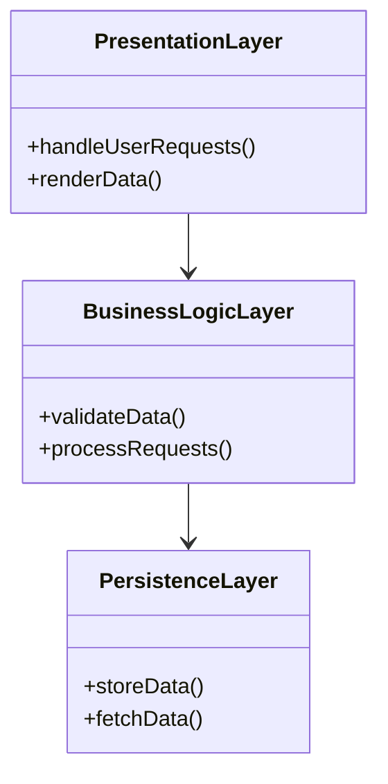

```mermaid
classDiagram
  class PresentationLayer {
    +handleUserRequests()
    +renderData()
  }
  class BusinessLogicLayer {
    +validateData()
    +processRequests()
  }
  class PersistenceLayer {
    +storeData()
    +fetchData()
  }
  PresentationLayer --> BusinessLogicLayer
  BusinessLogicLayer --> PersistenceLayer
```
