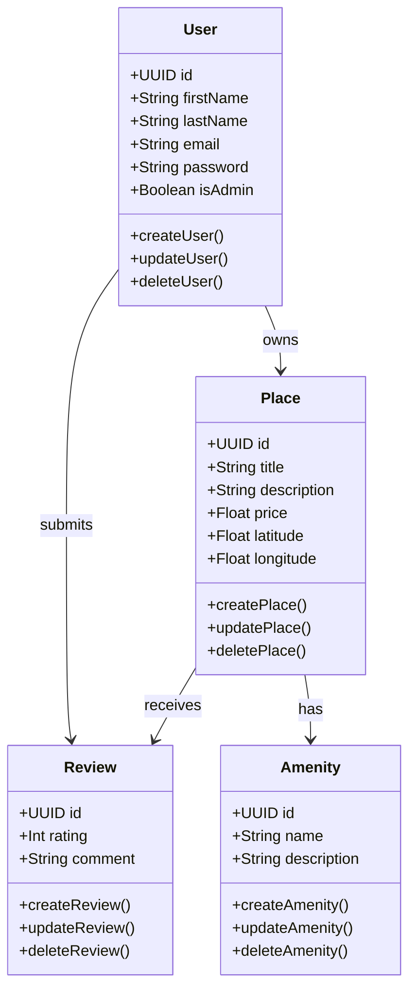

```mermaid
classDiagram
  class User {
    +UUID id
    +String firstName
    +String lastName
    +String email
    +String password
    +Boolean isAdmin
    +createUser()
    +updateUser()
    +deleteUser()
  }
  class Place {
    +UUID id
    +String title
    +String description
    +Float price
    +Float latitude
    +Float longitude
    +createPlace()
    +updatePlace()
    +deletePlace()
  }
  class Review {
    +UUID id
    +Int rating
    +String comment
    +createReview()
    +updateReview()
    +deleteReview()
  }
  class Amenity {
    +UUID id
    +String name
    +String description
    +createAmenity()
    +updateAmenity()
    +deleteAmenity()
  }
  User --> Place : owns
  User --> Review : submits
  Place --> Review : receives
  Place --> Amenity : has
```