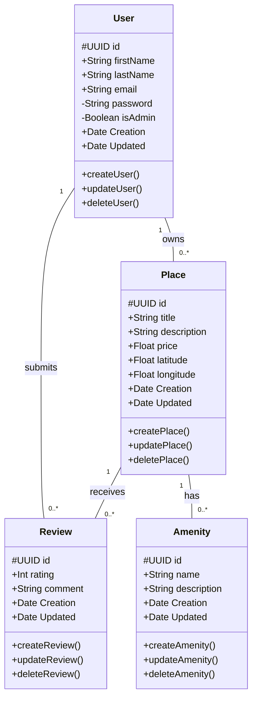

```mermaid
classDiagram
    class User {
        #UUID id
        +String firstName
        +String lastName
        +String email
        -String password
        -Boolean isAdmin
        +Date Creation
        +Date Updated
        +createUser()
        +updateUser()
        +deleteUser()
    }

    class Place {
        #UUID id
        +String title
        +String description
        +Float price
        +Float latitude
        +Float longitude
        +Date Creation
        +Date Updated
        +createPlace()
        +updatePlace()
        +deletePlace()
    }

    class Review {
        #UUID id
        +Int rating
        +String comment
        +Date Creation
        +Date Updated
        +createReview()
        +updateReview()
        +deleteReview()
    }

    class Amenity {
        #UUID id
        +String name
        +String description
        +Date Creation
        +Date Updated
        +createAmenity()
        +updateAmenity()
        +deleteAmenity()
    }

    User "1" -- "0..*" Place : owns
    User "1" -- "0..*" Review : submits
    Place "1" -- "0..*" Review : receives
    Place "1" -- "0..*" Amenity : has

```