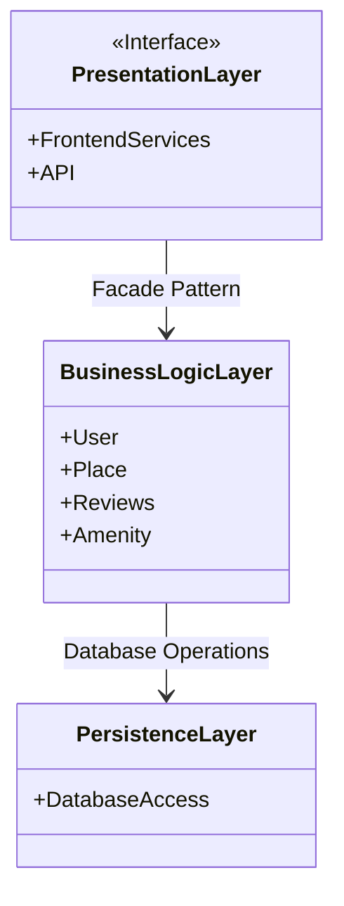
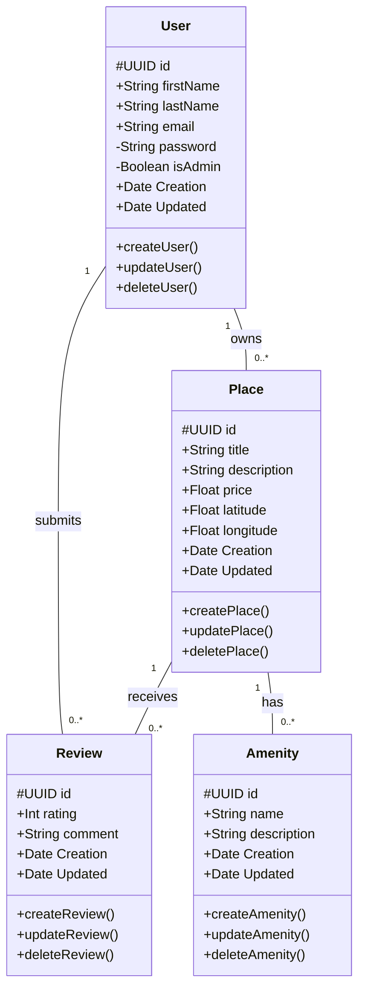
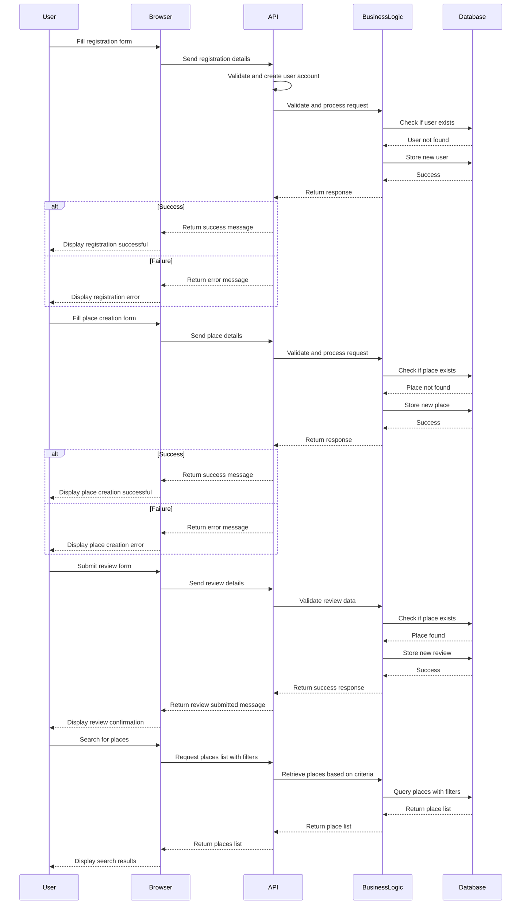

# 🏠 HBnB Project – Documentation  

## 📌 Introduction  

### 🎯 Objective  
This document provides a detailed plan for the **HBnB Evolution** application. It consolidates all diagrams and explanatory notes into a comprehensive technical reference, guiding the implementation phases and clarifying the system's architecture and design.  

### 📍 Project Scope  
**HBnB Evolution** is a simplified application inspired by Airbnb that allows users to:  
✔️ Register  
✔️ Add properties  
✔️ Associate amenities   
✔️ Submit reviews  

This documentation covers:  
📂 **General architecture** (package diagram)  
🛠 **Business model** (detailed class diagram)  
🔄 **API interactions** (sequence diagrams)  

---

## General Architecture  

### **Package Diagram**  
The architecture follows a **layered model**, integrating the **facade pattern** to simplify interactions between components.  

**The 3 main layers**:  

1️⃣ **Presentation Layer**  
- Manages the user interface and interactions.  
- Receives requests and returns responses after processing.  

2️⃣ **Business Logic Layer**  
- Contains key models (**User, Place, Review, Amenity**).  
- Implements business rules and orchestrates operations.  
- Acts as a **facade** for communication with the persistence layer.  

3️⃣ **Persistence Layer**  
- Manages the database and CRUD operations.  
- Structures data to ensure integrity and consistency.  

## 🛠️ Business Logic Layer  

### 📌 **Class Diagram**  
The core of the application relies on several **key entities**:  

### High-Level Architecture - classDiagram

### 🔗 **Entity Relationships**  
✔️ **A user** can own multiple **places** and leave multiple **reviews**.  
✔️ **A place** can receive multiple **reviews** and be associated with multiple **amenities**.  

The architecture of the business logic layer ensures **consistency, scalability, and modularity**.  

---
## 🔄 API Interaction Flow  

### 📊 **Sequence Diagrams for API calls**  

#### 📝 **1. User Registration**  
1️⃣ The user sends their information (**name, email, password**) to the **Presentation Layer**.  
2️⃣ It validates and forwards them to the **Business Logic Layer**.  
3️⃣ After validation, the data is stored via the **Persistence Layer**.  
4️⃣ A success or failure response is returned.  

#### 🏡 **2. Place Creation**  
1️⃣ The user submits a creation request (**title, description, etc.**).  
2️⃣ The **Presentation Layer** forwards the request to the **Business Logic Layer**.  
3️⃣ After validation, the data is inserted via the **Persistence Layer**.  
4️⃣ A confirmation is returned.  

#### ⭐ **3. Review Submission**  
1️⃣ The user wants to leave a review for a place.  
2️⃣ The **Presentation Layer** sends the details (**rating, comment, etc.**) to the **Business Logic Layer**.  
3️⃣ The review is stored via the **Persistence Layer**, and a response is returned.  

#### 📍 **4. Retrieving Available Places**  
1️⃣ The user requests the list of available places.  
2️⃣ The **Presentation Layer** queries the **Business Logic Layer**, which consults the **Persistence Layer**.  
3️⃣ The results are returned and displayed to the user.  

---

## 📌 Conclusion  

This document is a **comprehensive technical guide** for **HBnB Evolution**. It provides:  

📂 **An overview of the architecture** and the **facade pattern** 🏗️  
📊 **A structured business model** with a class diagram 🔍  
🔄 **A detailed API interaction schema** outlining the main operations  

🔹 **Readability and professionalism** ensure a clear understanding for developers throughout the implementation.  
🔹 This document will evolve to reflect project updates.  
