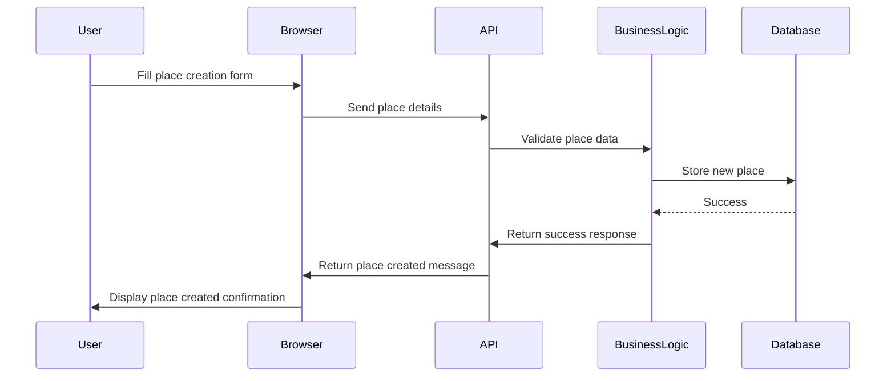

```mermaid
sequenceDiagram
    participant User
    participant Browser
    participant API
    participant BusinessLogic
    participant Database

    # Place Creation: A user creates a new place listing.

    User->>Browser: Fill place creation form
    Browser->>API: Send place details
    API->>BusinessLogic: Validate place data
    BusinessLogic->>Database: Store new place
    Database-->>BusinessLogic: Success
    BusinessLogic->>API: Return success response
    API->>Browser: Return place created message
    Browser->>User: Display place created confirmation
```
