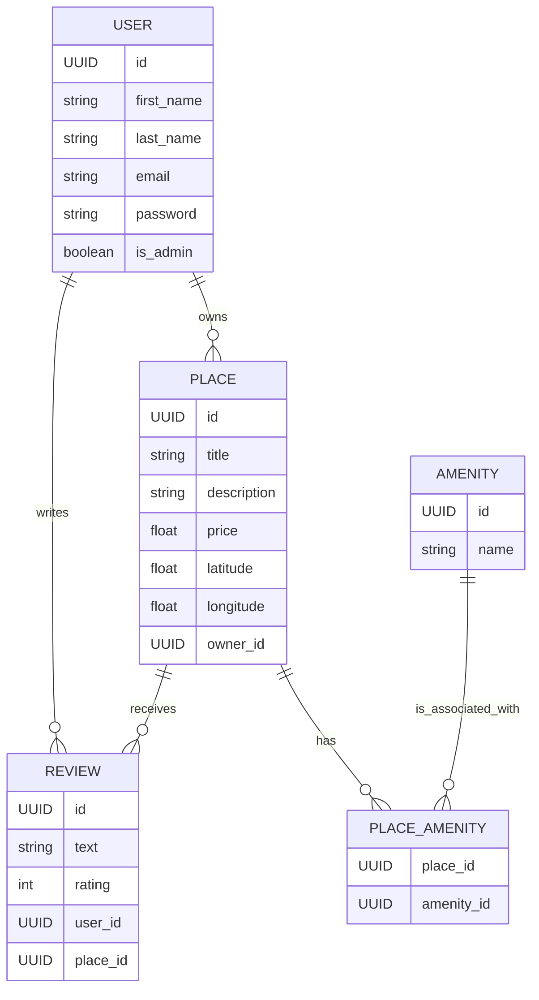

## Entity-Relationship Diagram

```mermaid
erDiagram
    USER {
        UUID id
        string first_name
        string last_name
        string email
        string password
        boolean is_admin
    }

    PLACE {
        UUID id
        string title
        string description
        float price
        float latitude
        float longitude
        UUID owner_id
    }

    REVIEW {
        UUID id
        string text
        int rating
        UUID user_id
        UUID place_id
    }

    AMENITY {
        UUID id
        string name
    }

    PLACE_AMENITY {
        UUID place_id
        UUID amenity_id
    }

    USER ||--o{ PLACE : owns
    USER ||--o{ REVIEW : writes
    PLACE ||--o{ REVIEW : receives
    PLACE ||--o{ PLACE_AMENITY : has
    AMENITY ||--o{ PLACE_AMENITY : is_associated_with
```
